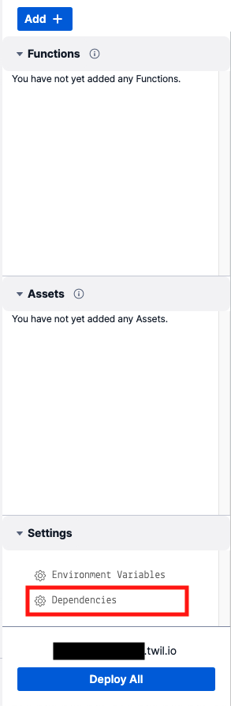

# Funtionへのリクエスト情報にアクセス

このセクションではTwilio Functionsの実行時に利用される[`Runtime Handler`](https://www.twilio.com/docs/runtime/handler)を用いてFunctionへのリクエストヘッダーやクッキーにアクセスする方法を学習します。

::: warning 注意
リクエストヘッダーやクッキーにアクセスする場合は、Runtime Handlerのバージョンを1.2.0以降とする必要があります。2022年2月時点において新規でServiceを作成した場合は、バージョン1.2.1が自動的に使用されます。
:::

__目次__
[[toc]]

## Runtime Headerのバージョンを確認

過去に作成したTwilio Functionの場合は、UIエディター下部の`Dependencies`から依存関係とバージョンを確認できます。



今回のハンズオンでFuntionを作成した場合は下記のスクリーンショットのようになります。


## リクエスト情報にアクセス

Functionを1つ作成し、PathとVisibilityそれぞれ次のようにします。

|名前|値|
|---|---|
| Path| requests|
| Visibility| Public|

また、デフォルトのコードを次のように変更します。

```js
exports.handler = function(context, event, callback) {
};
```

この関数に渡される`event`オブジェクトを用いてリクエスト情報にアクセスできます。

### Authorizationヘッダーを使い、基本認証を実施

ここからは下記で紹介されているサンプルについて日本語の手順を確認しながら実装します。

- [Protect your Function with Basic Auth](https://www.twilio.com/docs/runtime/quickstart/basic-auth)

リクエスト情報にアクセスする場合は`event.request`を使用します。
その中でもヘッダー情報にアクセスできる`event.request.headers`を用いて基本認証機能を実装します。

最初にハイライトされたコードを追加します。このコードでは、`event.request.headers.authorization`でリクエストに含まれるAuthorizationヘッダーを取得しています。

```js{2-14}
exports.handler = function(context, event, callback) {

  // このハンズオンではユーザー名とパスワードをコードに直接記入します。
  const USERNAME = 'twilio';
  const PASSWORD = 'ahoy';

  // レスポンスオブジェクトの作成
  const response = new Twilio.Response();
  // Authorizationヘッダーを取得
  const authHeader = event.request.headers.authorization;

  // Authorizationヘッダーを取得できない場合は、リクエストを拒否する
  if (!authHeader) return callback(null, setUnauthorized(response))

};
```


Authorizationヘッダーを取得できた場合は、認証方式と認証情報を確認します。下記のハイライトされている行を追加します。

```js{15-32}
exports.handler = function(context, event, callback) {

  // このハンズオンではユーザー名とパスワードをコードに直接記入します。
  const USERNAME = 'twilio';
  const PASSWORD = 'ahoy';

  // レスポンスオブジェクトの作成
  const response = new Twilio.Response();
  // Authorizationヘッダーを取得
  const authHeader = event.request.headers.authorization;

  // Authorizationヘッダーを取得できない場合は、リクエストを拒否する
  if (!authHeader) return callback(null, setUnauthorized(response))

  // 認証方式および認証情報を取得
  const [authType, credentials] = authHeader.split(' ');

  // 認証方式が基本認証であることを確認
  if (authType.toLowerCase() !== 'basic')
    return callback(null, setUnauthorized(response));

  // 認証情報を分解
  const [username, password] = Buffer.from(credentials, 'base64')
    .toString()
    .split(':');

  // ユーザ名およびパスワードを認証
  if (username !== USERNAME || password !== PASSWORD)
    return callback(null, setUnauthorized(response))

  // 認証が完了した場合はOKを返す
  return callback(null, 'OK');
};
```

最後に`exports.handler`の最後で呼び出されている`setUnauthorized`関数を実装します。このメソッドはリクエストを拒否するレスポンスの中身を作成しています。`exports.handler`の __スコープ外__ に下記のコードを追加します。

```js
// 401 Unauthorizedをレスポンスとして返すためのヘルパーメソッド
const setUnauthorized = (response) => {
  response
    .setBody('Unauthorized')
    .setStatusCode(401)
    .appendHeader(
      'WWW-Authenticate',
      'Basic realm="Authentication Required"'
    );

  return response;
};
```

この段階でデプロイを行い、`/requests`のURLをブラウザーで開きます。
ユーザー名とパスワードを求めるダイアログが表示されるため、そちらに認証情報を入力し、`OK`が表示されることを確認してください。

::: tip
ログインが成功するとブラウザーを閉じるまでログイン状態が継続します。初期状態に戻す場合はブラウザーで開くアドレスを __https://me@<twilio functionのURL>__ とし、続けて表示されるポップアップを __キャンセル__ してください。ログイン状態が解除されます。
:::

## クッキーの設定と読み取り

次にクッキーへ値を設定しましょう。ユーザー名およびパスワードを認証したのち、クッキーに値を設定するコードを追加します。ハイライトの部分を追加、あるいは既存のコードを変更してください。

```js{32-49}
exports.handler = function(context, event, callback) {

  // このハンズオンではユーザー名とパスワードをコードに直接記入します。
  const USERNAME = 'twilio';
  const PASSWORD = 'ahoy';

  // レスポンスオブジェクトの作成
  const response = new Twilio.Response();
  // Authorizationヘッダーを取得
  const authHeader = event.request.headers.authorization;

  // Authorizationヘッダーを取得できない場合は、リクエストを拒否する
  if (!authHeader) return callback(null, setUnauthorized(response))

  // 認証方式および認証情報を取得
  const [authType, credentials] = authHeader.split(' ');

  // 認証方式が基本認証であることを確認
  if (authType.toLowerCase() !== 'basic')
    return callback(null, setUnauthorized(response));

  // 認証情報を分解
  const [username, password] = Buffer.from(credentials, 'base64')
    .toString()
    .split(':');

  // ユーザ名およびパスワードを認証
  if (username !== USERNAME || password !== PASSWORD) {
    return callback(null, setUnauthorized(response))
  }

  let msg = '';
  // クッキーにlastloginというキーを持つ値がセットされているかどうか
  if(!event.request.cookies['lastlogin']) {
    response.setCookie(
      "lastlogin", 
      new Date().toLocaleString('ja-JP', {timeZone: 'Asia/Tokyo'}));
    msg = 'ログイン完了。今回が初めての認証です。'
  } else {
    msg = `ログイン完了。最新の認証時刻は ${event.request.cookies['lastlogin']} です。`;
  }

  // ステータスコードとBodyを設定
  response
    .setBody(msg) 
    .setStatusCode(200);
  
  // OKの代わりにクッキーが設定されたレスポンスを送信
  return callback(null, response);
};
```

上記のコードでは、`Twilio.Response`オブジェクトの`setCookie`メソッドを使い、`lastlogin`というキーを持つ日時情報を文字列で保存しています。

このままではログイン状態を解除した後もクッキーに情報が残ってしまうので、`setUnauthorized`関数が呼び出された場合はクッキーの値を削除します。ハイライトされている行を追加してください。

```js{6}
// 401 Unauthorizedをレスポンスとして返すためのヘルパーメソッド
const setUnauthorized = (response) => {
  response
    .setBody('Unauthorized')
    .setStatusCode(401)
    .removeCookie('lastlogin')
    .appendHeader(
      'WWW-Authenticate',
      'Basic realm="Authentication Required"'
    );

  return response;
};
```

再度デプロイし、初回認証時と2回目以降の試行時に表示されるメッセージが異なることを確認してください。

## まとめ

このように`Runtime Handler 1.2.0`以降ではTwilio Functionsでリクエスト情報にアクセスが可能になっています。