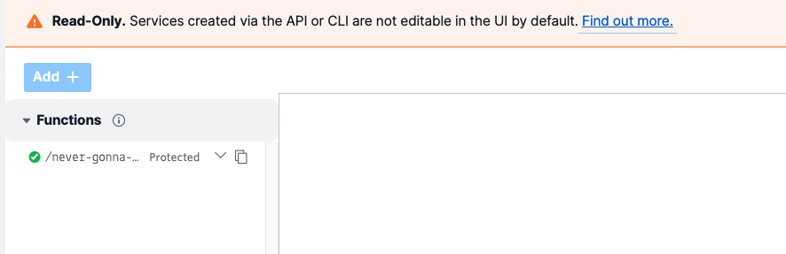
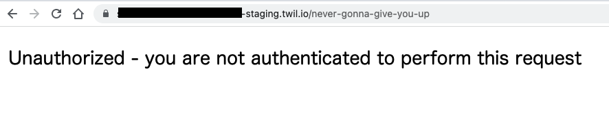

# Serverless Toolkitの使用

Twilio Functionsは[Twilio CLI](https://www.twilio.com/ja/docs/twilio-cli/quickstart)および[Serverless Toolkit](https://www.twilio.com/docs/labs/serverless-toolkit/getting-started#install-the-twilio-serverless-toolkit)を用いてローカル環境で開発する方法を提供しています。
このハンズオンでは __Serverless Toolkit__ を用いた __複数のEnvrionmentへのデプロイ方法__ について重点的に学習します。事前に下記の環境が揃っていることを確認してください。

- バージョン12.21以降の[Node.js](https://nodejs.org/ja/)
- Twilio CLIの[インストール](https://www.twilio.com/ja/docs/twilio-cli/quickstart)（[Twilioアカウントへのログイン](https://www.twilio.com/ja/docs/twilio-cli/quickstart#twilio%E3%82%A2%E3%82%AB%E3%82%A6%E3%83%B3%E3%83%88%E3%81%B8%E3%81%AE%E3%83%AD%E3%82%AF%E3%82%99%E3%82%A4%E3%83%B3)までを事前に済ませてください）
- Twilio Serverless Toolkitの[インストール](https://www.twilio.com/docs/labs/serverless-toolkit/getting-started#install-the-twilio-serverless-toolkit)

::: tip 情報
過去にインストールしたプラグインをアップデートする場合は、`twilio plugins:update`コマンドを実行します。
:::

::: warning 注意
すでにCLIをインストールしている場合は、今回のハンズオン用Twilioアカウントの資格情報をCLIで利用しているかどうかを確認してください。新たにプロファイルを作成する場合は、`twilio profiles:create`コマンドを使用し、作成したプロファイルを`twilio profiles:use`コマンドで指定します。
:::

__目次__
[[toc]]

## ローカル環境にプロジェクトを作成

次のコマンドでプロジェクトを作成します。

```bash
twilio serverless:init serverless-handson --template never-gonna-give-you-up
```

作成後、画面の指示に従い実行します。

```bash
cd serverless-handson
npm start
```

この段階で[http://localhost:3000/never-gonna-give-you-up](http://localhost:3000/never-gonna-give-you-up)をブラウザーで開くと、[TwiML](https://jp.twilio.com/docs/voice/twiml/pay) が表示されます。

このプロジェクトフォルダーの中にある`/functions/never-gonna-give-you-up.protected.js`を開くと、先ほどのTwiMLを出力するためのコードを確認できます。

```js
exports.handler = function(context, event, callback) {
  const twiml = new Twilio.twiml.VoiceResponse();
  twiml.play('https://demo.twilio.com/docs/classic.mp3');
  callback(null, twiml);
};
```

::: tip 情報
Serverless Toolkitを使用する場合は、Visibilityをファイル名で指定します。`Protected`の場合は、`aaaa.protected.js`、`Public`の場合は、`aaaa.privated.js`と名前をつけてください。
:::

今回はコードを変更しません。

## プロジェクトのデプロイとコンソールからの制御

ローカル環境に構築したプロジェクトをクラウド環境にデプロイします。

```bash
twilio serverless:deploy
```

デプロイ中、次のようなメッセージが表示されます。

```
Username        SKb*****************************
Password        YdTk****************************
Service Name    serverless-handson
Environment     dev
Root Directory  /******/serverless-handsOn
Dependencies	twilio, @twilio/runtime-handler
Env Variables	TWILIO_VOICE_WEBHOOK_URL
Runtime		node12

✔ Serverless project successfully deployed

Deployment Details
Domain: *****-dev.twil.io
Service:
   serverless-handsOn (ZS*****************************)
Environment:
   dev (ZE*****************************) 
Build SID:
   ZB*****************************
View Live Logs:
   https://www.twilio.com/console/assets/api/
      ZS*****************************/environment/ZE*****************************
Functions:
   [protected] https://*****-dev.twil.io/my-new-function/hello-world
   https://*****-dev.twil.io/never-gonna-give-you-up
Assets:

```

デプロイの際に`package.json`の`name`に設定された値をもとに`Service`が作成されます。特に環境名を指定しない場合、このServiceに`dev`という名前がついた`Environment`も併せて作成されます。デプロイ時に使用できるオプションについては`twilio serverless:deploy --help`コマンドで確認できます。

一旦デプロイを行うとプロジェクトフォルダの`.twiliodeployinfo`ファイルに各種情報が保存されます。

```json
{
	"AC********************************": {
		"serviceSid": "ZS********************************",
		"latestBuild": "ZB********************************"
	}
}
```

この情報をもとに2回目以降のデプロイ時に新しいビルドの作成、更新が実行されます。


また、Serverless Toolkitを使用したプロジェクトの場合、標準ではUIエディターでの変更は許可されていません。コンソールから該当するサービスを開くと下記のように表示されます。



予期せぬ変更を防ぐため基本的にはローカル環境で開発、テストを行うことが理想的ですが、デプロイ後に手動でコードを変更したい場合は、サービスをCLIから更新しUIの編集を許可できます。この際先ほどのファイルに記録された`serviceSid (ZS*****************************)`を指定する必要があります。下記のコマンドをデプロイ時に表示された`serviceSid`を入力し実行してください。

```bash
twilio api:serverless:v1:services:update --sid <servideSidの値> --ui-editable
```

コンソールでの制御を不許可にする場合は`--no-ui-editable`オプションを指定し、サービスを更新します。

```bash
twilio api:serverless:v1:services:update --sid <servideSidの値> --no-ui-editable
```

::: tip 情報
Twilioコンソールでの制御が不許可になっている場合は、Serviceの削除をUI上から実行できません。ターミナルから次のコマンドを使用します。  
`twilio api:serverless:v1:services:remove --sid <servideSidの値>`
:::

::: warning 注意
上記コマンでサービスを削除した場合は`.twiliodeployinfo`ファイルの情報をクリアする必要があります。そのままにしておくと、再度デプロイを実行した際にサービスが存在しないというエラーが発生します。
:::

## 複数の環境にデプロイ

標準では`dev`というEnvironmentが作成されます。別のEnvironmentを作成する場合は`twilio serverless:promoate`コマンドを実行します。今回のハンズオンでは、ステージング用のEnvironmentである`staging`を作成します。指定するオプションについては下記を確認してください。

|オプション名|説明|設定値|
|---|---|------|
| --service-sid| 対象となるServiceのSID| 先ほどのデプロイ時に表示された値|
| --source-environment または --from | 複製元となるEnvironmentの名前またはEnvironment SID| dev|
| --environment または --to | 複製先のEnviromentの名前またはEnvironment SID| staging|
| --create-environment | このフラグを指定すると複製先のEnvironmentが存在しない場合に新規に作成される | フラグを指定 |

実行するコマンドは次のようになります。

```bash
twilio serverless:promote --service-sid=<serviceSidの値> \
 --from=dev --to=staging --create-environment
```

下記のURL情報を参考に発行された`staging`のURLをブラウザーで開きます。

```
https://serverless-handson-****-staging.twil.io/never-gonna-give-you-up
```

ローカル環境では`protected`となっていたFunctionにアクセスできましたが、デプロイ後はリクエストヘッダの署名を確認しているため、アクセスができないことを示すエラーが表示されます。



この状態をエラーだと仮定し、修正しましょう。`/functions/never-gonna-give-you-up.protected.js`のファイル名を`never-gonna-give-you-up.js`と変更し、`dev`環境にデプロイします。
デプロイ後、下記のURL情報を参考に`dev`のURLをブラウザーで開き、TwiMLが返されることを確認します。

```
https://serverless-handson-****-dev.twil.io/never-gonna-give-you-up
```

`dev`と`staging`が異なる結果を返すことを確認し、このセクションは完了です。