# コンソールからTwilio Functionsを利用

このセクションでは[Twilioコンソール](https://console.twilio.com)からTwilio Functionsを利用する方法を学習します。

__目次__
[[toc]]

## コンソールからFunctionsを表示

[Twilioコンソール](https://console.twilio.com)を開き、サイドナビゲーションに表示されている[Explore Products](https://console.twilio.com/develop/explore)を開き、`Developer tools` - `Functions`を選択します。

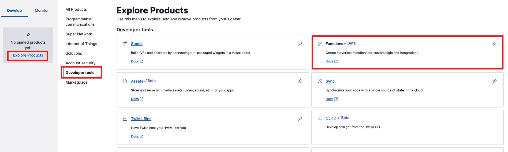

もし見つからない場合は下記のリンクから直接開いてください。

- [Functionsコンソール](https://www.twilio.com/console/functions)

## サービスの作成

新しいFunctionsは`Service`と呼ばれるアプリケーションコンテナで管理されます。プロジェクトごとに個別のServiceを作成できます。

`Overview`あるいは`Services`画面において`Create Service`ボタンをクリックし新しいサービスを作成します。

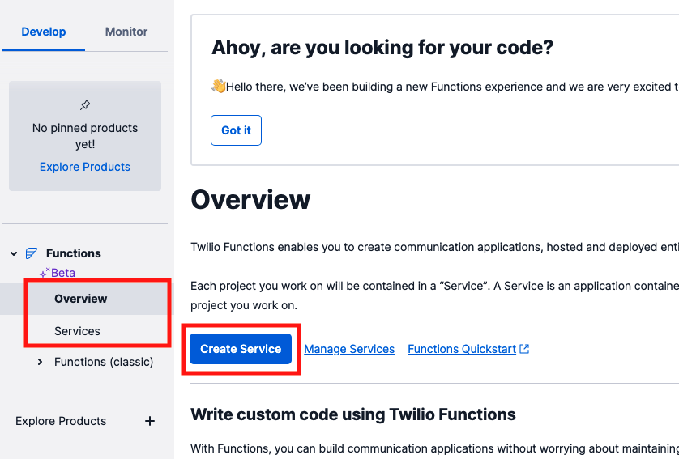

サービス名の入力を求められるため、任意の名前を設定します。デプロイ時のURLとして利用されるため、日本語やURLで使用できないような名前を設定することは避けます。

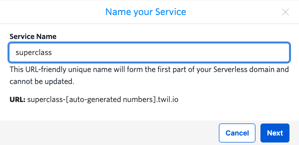

`Service`が作成され、UIエディターが表示されます。`Service`ではロジックを実装する`Functions`および静的コンテンツを保持する`Assets`が用意されています。

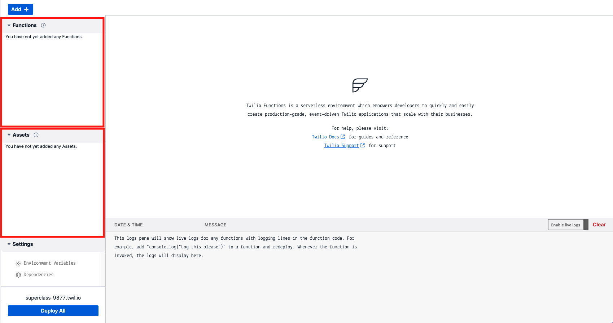

## Functionの追加とVisibility

UIエディターの `Add +`ボタン - `Add Function`をクリックし、新しいFunctionを追加します。

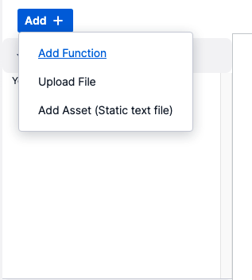

この際、Functionのパスを設定する必要があります。ここでは下記の値を設定します。

|名前|値|
|---|---|
| Pathの値| superclass|

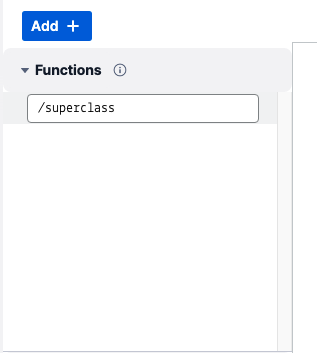

作成したFunctionにはデフォルトでVoice TwiMLを返すロジックが実装されています。

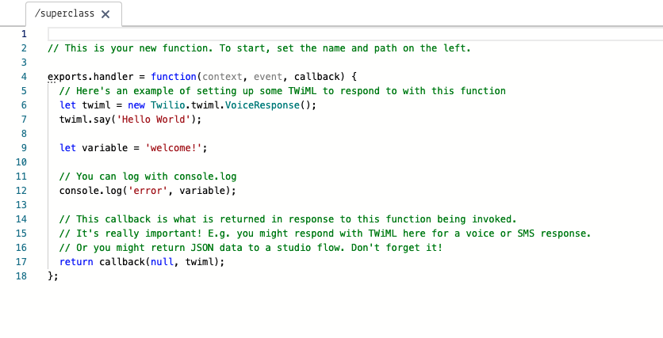

UIエディター下部の`Deploy All`　ボタンをクリックしデプロイを実行します。

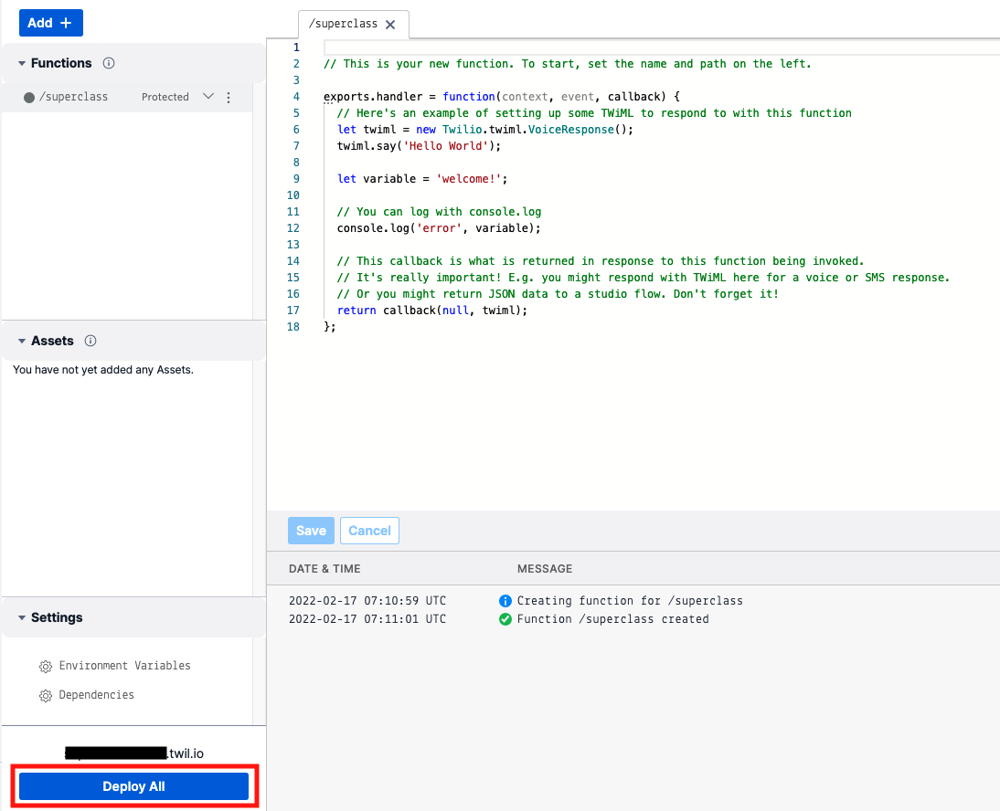

デプロイされたFunctionのパスはUIエディターで確認できます。下記のスクリーンショットを参考にURLを取得し、ブラウザーからアクセスします。

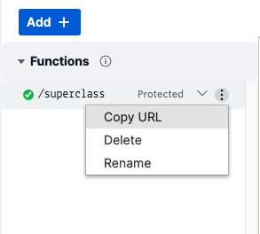

実行結果は下記のスクリーンショットのようにアクセスエラーとなります。

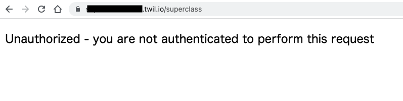

UIからFunctionを作成した場合はVisibility（アクセスレベル）が`Protected`となっており、Twilio内部からのアクセスのみに応答します。これはTwilioからのリクエストヘッダーに含まれる、`X-Twilio-Signature`の値を検証することで判定しています。そのため、外部アプリケーションからProtected Functionにアクセスする場合は`X-Twilio-Signature`のキーを持つ署名をリクエストに追加する必要があります。
どのように署名の作成しているかについては下記のトピックをご覧ください。

- [セキュリティ](https://jp.twilio.com/docs/usage/security)

Pathタイルに表示されている`Protected`をクリックするとVisibilityを変更できます。`Public`と変更したのち、`Deploy All`ボタンをクリックし、デプロイを行います。

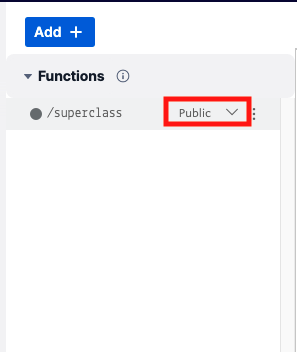

再度ブラウザーでアクセスし、TwiMLが返されることを確認します。

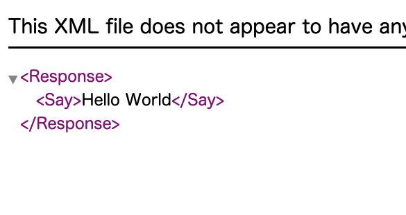

このVisibilityのコンセプトはAssetsにも適用されます。

## Private Functionの追加

Visibilityを`Private`とした場合は、他のFunctions、あるいはAssetsからのみアクセスが可能です。このため、複数のFunctionで利用する共通ロジックや秘匿性が高いデータそのもののをPrivate Function、Private Assetとして定義、アップロードできます。

UIエディターから次のFunctionを追加してください。

|名前|値|
|---|---|
| Pathの値| yesorno|
| Visibility| Private|

`yesorno`の実装は下記の通りです。

```js
exports.judge = function(threshold) {

  const threshold_num = Number(threshold);

  if (Math.random() * 100 < threshold_num)
    return "Yes";
  else
    return "No";
};
```

`judge`という名前を持つ関数を実装し、乱数が`threshold`に設定されたしきい値未満の場合は`Yes`を、そうでなければ`No`を返します。

続けて、`superclass`の実装を次のように変更します。

```js
exports.handler = function(context, event, callback) {

  // プライベートFunctionのパスを取得
  const yesornoPath = Runtime.getFunctions()['yesorno'].path;
	// Functionをインポート
  const yesorno = require(yesornoPath);
  // judgeメソッドを呼び出し
  return callback(null, yesorno.judge(50));
};
```

ここまでの変更を加えると、UIエディターは下記の通りになります。

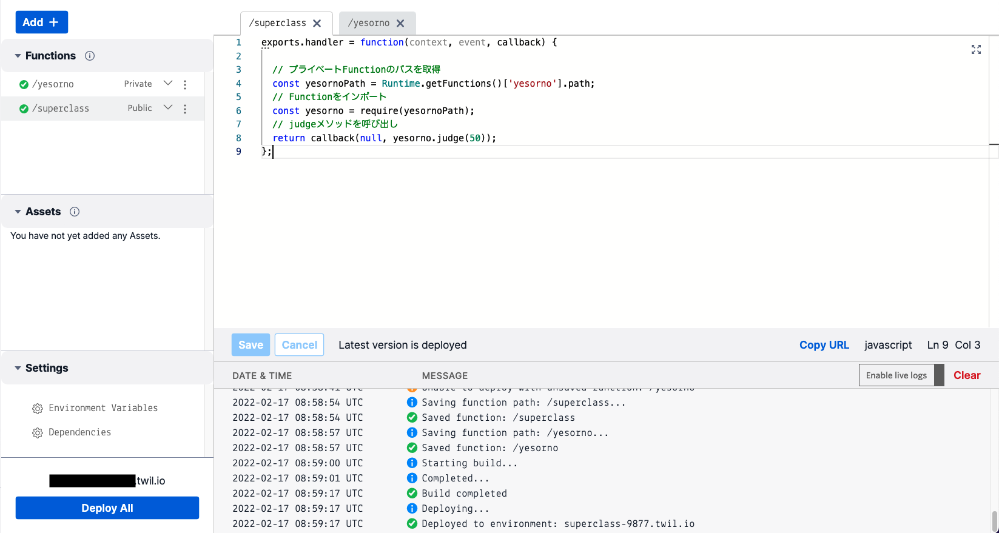

再度ブラウザーで`superclass`のURLにアクセスし、正しくPrivate Functionが読み込まれていること、そして出力が一定ではないことを確認します。

## まとめ

ここまでのハンズオンで、Twilio Functionsの作成および、デプロイ、Visibilityの設定方法について学習しました。次のセクションではFunctionへのリクエスト情報にアクセスする方法を学習します。
