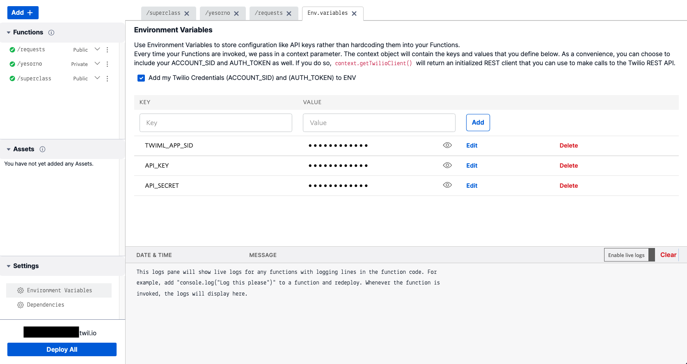

# Twilio Clientを用いた電話番号を利用しない通話の実装

このセクションでは[Twilio Client]()を用いたブラウザーフォンを実装し、匿名通話を実装します。Twilio Clietnは通常の電話番号への発着信も可能なため、厳密には匿名通話専用の機能ではありません。ただし、`Client ID`を用いてブラウザーフォン同士が通話できるため、結果として電話番号が不要となります。

__目次__
[[toc]]

## コンソールでTwiML Appを作成

[Programmable Voiceコンソール](https://www.twilio.com/console/voice/twiml/apps)のTwiMLセクションを開き、`Create new TwiML App`ボタンをクリックします。


`FRIENDLY NAME`にわかりやすい名前を入れ、それ以外は空欄のまま、`Create`ボタンをクリックします。


作成後、TwiML Appの一覧が表示されるので先ほど作成したAppの名前をクリックし、詳細画面を表示します。

画面に表示される`SID`を控えておきます。


このTwiML Appはのちほど利用します。

## アクセストークンを生成するために必要なAPIキーとAPIシークレットを生成

今回実装するブラウザーフォンはエンドユーザーの端末で利用されます。そのため、Twilioのサービスを利用する場合は`Account SID`や`Auth Token`ではなく、サーバーアプリケーション側で`アクセストークン`を生成し、そちらを利用しなければいけません。

ここではサーバーアプリケーションで利用する`APIキー`および`APIシークレット`を生成します。

コンソールの右上に表示されている`Account`メニューから`API keys & tokens`を選択します。


::: tip 情報
APIキー、APIシークレットのような重要な情報にアクセスする場合、本人であることを再度確認するため、アカウントに登録されているメールアドレスに認証コードが送信されます。送られてきたコードを入力し、`Verify`ボタンをクリックします。
:::

認証後に表示される画面で`Create API key`ボタンをクリックします。


`Friendly name`にわかりやすい名前をつけ、その他の項目は初期値のままとし、`Create API Key`ボタンをクリックしAPIキーを作成します。


APIキーとその`SID`、`Secret`が作成されます。それぞれの情報を控えてください。


::: warning 注意
`Secret`はこの画面でのみ表示され、閉じると再度確認する方法がありません。正しく値を控えてください。また、この情報を用いてTwilio APIにアクセス可能できるため取り扱いには十分注意してください。
:::

## Twilio Functionsに環境変数を設定

今回はサーバーアプリケーションに相当する機能をTwilio Functionsを用いて実装します。先ほどのハンズオンで作成したサービスのUIエディターを開き、画面下部に表示されている、`Environment Variables`をクリックします。


この画面で環境変数を追加します。先ほど控えた情報をもとに下記のキーを持つ環境変数を追加します。

|キー名|値|
|---|---|
| TWIML_APP_SID | TwiML Appを作成した際に生成されたSIDの値|
| API_KEY| API Key SIDの値|
| API_SECRET| API Key Secretの値|


追加した画面は下記のようになります。`Add my Twilio Credentials (ACCOUNT_SID) and (AUTH_TOKEN) to ENV`にチェックが入っていることも確認してください。



## アクセストークンを生成するFunctionを作成

Functionを1つ作成し、PathとVisibilityそれぞれ次のようにします。

|名前|値|
|---|---|
| Path| voice-token|
| Visibility| Public|

::: warning 注意
Visibilityを`Public`と指定した場合は外部からのリクエストを全て許可することになります。アクセストークンとアカウントが保持しているTwilio番号を使うと音声通話の発信・着信が可能となるため、トークン発行の前に認証する、トークンの生存期間を利用目的に影響を及ぼさない範囲で可能な限り短くする、などの対策が必要となります。
:::

## Twilio Clientの識別子を取得

Twilio Clientを利用する場合、識別子が必要となります。今回はリクエストから取得するため、`/voice-token`パスの実装を下記に変更します。

```js
exports.handler = function(context, event, callback) {

  // クライアントの識別子をリクエストから取得
  const identity = event.identity;

};
```

本番の開発ではこのidentityが一意の値となるようにロジックを追加してください。

## VoiceGrantの設定

続けて、`TWIML_APP_SID`を外部発信のアプリケーション SIDとし、着信も許可（`incomingAllow: true`）としたVoiceGrantオブジェクトを作成します。

```js{6-14}
exports.handler = function(context, event, callback) {

  // クライアントの識別子をリクエストから取得
  const identity = event.identity;
  
  //アクセストークン、音声機能の許可（VoiceGrant）を定義
  const AccessToken = Twilio.jwt.AccessToken;
  const VoiceGrant = AccessToken.VoiceGrant;

  // 指定したTwiML Appを着信可能な状態で利用できる許可を設定
  const voiceGrant = new VoiceGrant({
      outgoingApplicationSid: context.TWIML_APP_SID,
      incomingAllow: true
  });

};
```

## アクセストークンを生成し、VoiceGrantを割り当て

`ACCOUNT_SID`、`API_KEY`、`API_SECRET`、`identity`を用いてアクセストークンを生成したのち、続けて先ほど作成したVoiceGrantを設定します。

```js{16-25}
exports.handler = function(context, event, callback) {

  // クライアントの識別子をリクエストから取得
  const identity = event.identity;
  
  //アクセストークン、音声機能の許可（VoiceGrant）を定義
  const AccessToken = Twilio.jwt.AccessToken;
  const VoiceGrant = AccessToken.VoiceGrant;

  // 指定したTwiML Appを着信可能な状態で利用できる許可を設定
  const voiceGrant = new VoiceGrant({
      outgoingApplicationSid: context.TWIML_APP_SID,
      incomingAllow: true
  });

  // アクセストークンの生成
  const token = new AccessToken(
      context.ACCOUNT_SID,
      context.API_KEY,
      context.API_SECRET,
      { identity: identity }
  );

  // トークンに許可した機能を定義
  token.addGrant(voiceGrant);

};
```

## アクセストークンをレスポンスとして送信

最後に`toJwt()`メソッドを使用し、コールバックでアクセストークンを送信します。

```js{27-28}
exports.handler = function(context, event, callback) {

  // クライアントの識別子をリクエストから取得
  const identity = event.identity;
  
  //アクセストークン、音声機能の許可（VoiceGrant）を定義
  const AccessToken = Twilio.jwt.AccessToken;
  const VoiceGrant = AccessToken.VoiceGrant;

  // 指定したTwiML Appを着信可能な状態で利用できる許可を設定
  const voiceGrant = new VoiceGrant({
      outgoingApplicationSid: context.TWIML_APP_SID,
      incomingAllow: true
  });

  // アクセストークンの生成
  const token = new AccessToken(
      context.ACCOUNT_SID,
      context.API_KEY,
      context.API_SECRET,
      { identity: identity }
  );

  // トークンに許可した機能を定義
  token.addGrant(voiceGrant);

  // コールバック関数でtokenを返す
  return callback(null, { token: token.toJwt()});

};
```

`Save`ボタンで保存後、`Deploy All`ボタンをクリックしてFunctionをデプロイします。

デプロイ後、`vocie-token`のURLをブラウザで開いてください。その際に`identity`をリクエスト文字列で指定します。下の例を参考にしてください。

```bash
https://xxxx.twilio.io/voice-token?identity=neri78
```

画面に出力された`token`の値を[jwt.io](https://jwt.io/)でデコードするとidentityやVoiceGrantの値を確認できます。

これでブラウザからTwilioの機能を利用するためのアクセストークンを生成できるようになりました。

## TwiML Appの発着信機能を実装

TwiML Appで発着信が発生した場合のロジックを実装するため、新たに次のFunctionを追加します。VisibilityはTwiML App（Twilio内部）からのみ呼び出されるため、`Protected`としておきます。


|名前|値|
|---|---|
| Path| call|
| Visibility| Protected|


`/call`ではリクエストから渡された情報をもとに発着信を処理するコードを記述します。今回の実装ではTwiML Appからのコールバックに含まれるTwilio Clientの接続先を取得し、接続します。

```js
exports.handler = function(context, event, callback) {

  // Voice用TwiMLの作成
  const VoiceResponse = Twilio.twiml.VoiceResponse;
  const voiceResponse = new VoiceResponse();
  
  // 接続先を取得
  const to = event.To;
  
  // Dial verbを用いて接続
  const dial = voiceResponse.dial();
  dial.client(to);

  return callback(null, voiceResponse);

};
```

今回は電話番号との接続しないため、サーバー側のロジックは至ってシンプルです。ここで作成した`/call`のURLを控えておきます。


## TwiML Appの設定

クライアント側を実装する前にTwiML Appと先ほど作成した`/call`を紐付けます。
[Programmable Voiceコンソール](https://www.twilio.com/console/voice/twiml/apps)から先ほど作成したTwiML Appを開き、`/call`のURLを`Request URL`に指定します。


## クライアント側アプリケーションの配備

Twilio Clientを利用する場合はクライアント側のアプリケーションを実装する必要があります。今回は時間を短縮するため、あらかじめ実装済みのアプリケーションを使用します。下記のフォルダからアセット一式を取得してください。

- [ブラウザーフォンクライアント側ファイル一式](https://github.com/neri78/superclass-jp-feb-2022/raw/main/assets/browser-phone.zip)

ダウンロードしたファイルを解凍し、Twilio FunctionsのUIエディターから`Add +` - `Upload File`を選択します。4つのファイルを全て選択し、Visibilityを`Public`と設定します。下記のスクリーンショットを参考にしてください。


アップロード後、デプロイを実行し、`/browser-phone.html`のURLをブラウザーで開きます。下記のような画面が表示されていればデプロイが完了しています。


最初のテキストボックスにはTwilio Clientのユーザー名を英数字で入力します。初期化ボタンをクリックすると、内部では先ほど実装したアクセストークン生成Functionにリクエストを送信し、取得したトークンをもとに`Twilio.Device`の初期化・登録作業を実行しています。

下記の部分が該当するコードになります。

```js
// 初期化ボタンをクリックした際にアクセストークンを取得し、Twilio.Deviceを初期化する。
initButton.addEventListener('click', async() => {

    const identity = identityField.value;
    // トークンを取得
    let response = await fetch(`/voice-token?identity=${identity}`, {
        method: 'GET',
        headers: {
            'Content-Type' : 'application/json'
        }
    });
    let {token}  = await response.json();
    
    // トークンを用いて初期化
    device = new Twilio.Device(token);
    device.register();

    // Twilio Clientの準備ができた段階で発信ボタンを有効化
    device.on('registered', () => {
        identityField.disabled = true;
        callButton.disabled = false;
        connectButton.disabled = true;
        initButton.disabled = true;
    });

    // Twilio Clientの着信時に応答ボタンを有効化
    device.on('incoming', (incomingCall) => {
        callButton.disabled = true;
        connectButton.disabled = false;

        activeCall = incomingCall;
        // 着信通話が完了した時点で、原状復帰
        activeCall.on('disconnect', callDisconnected);

    });

});
```

初期化が完了するとユーザー名のフィールドが編集無効となり、発信ボタンが有効化されます。


もう1枚ブラウザーのタブを開き、別の名前でブラウザーフォンの初期化を実行してください。

発信先に別のブラウザータブで指定した名前を入力し、発信ボタンをクリックするとTwiML Appを用いて発信が行われます。この際、TwiML Appに指定したRequest URLが呼び出され、TwiMLに従って接続されます。

ハウリングが起きてしまいますが、双方のブラウザーで通話が可能であること、そして、一方の通話を終了した段階でもう一方の通話も終了することを確認してください。

