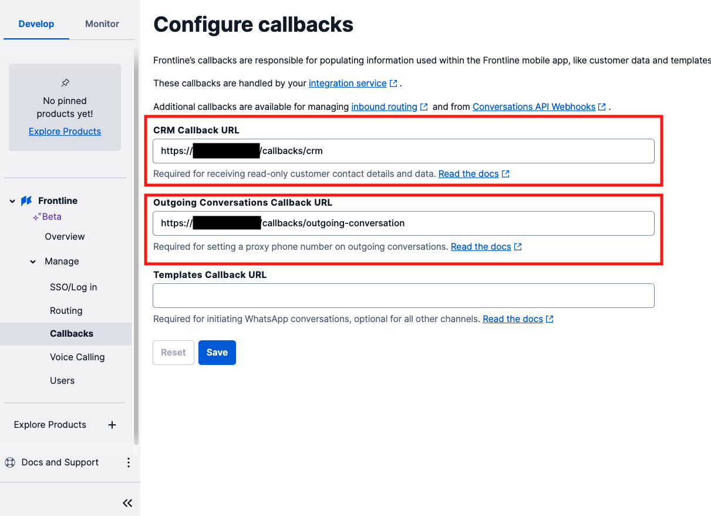
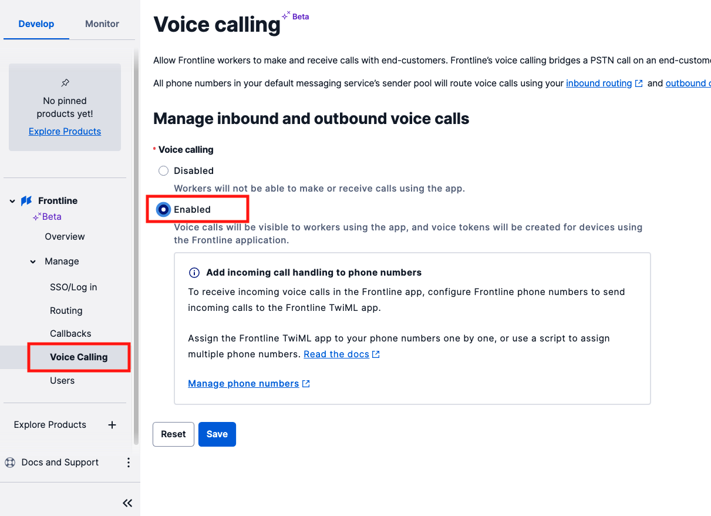
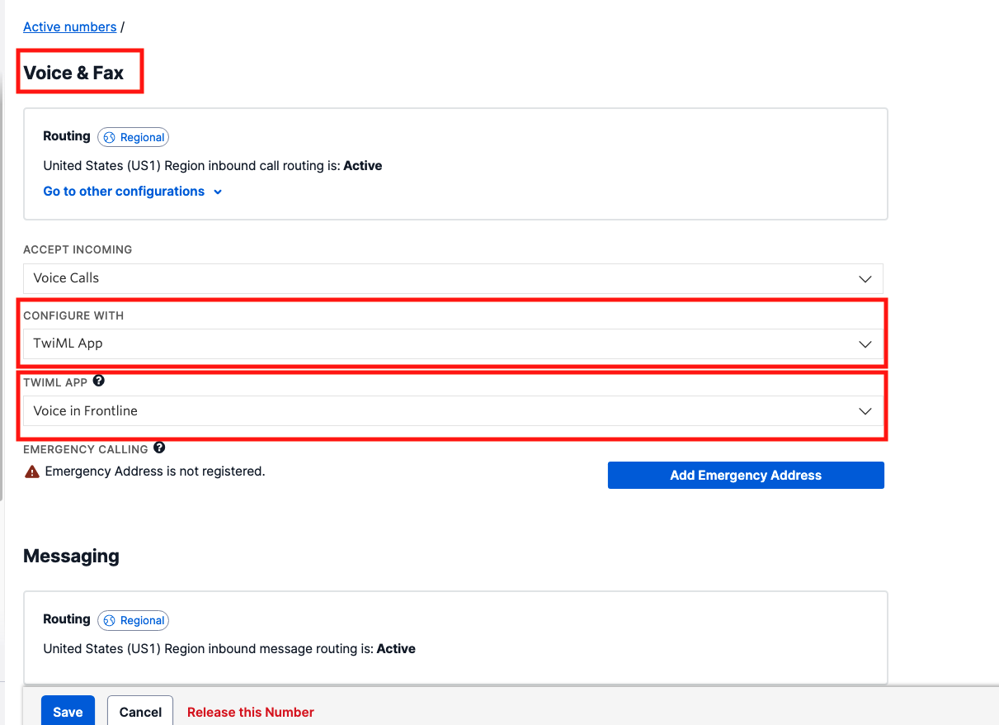
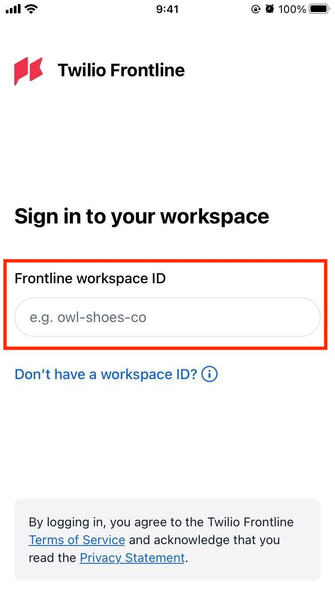
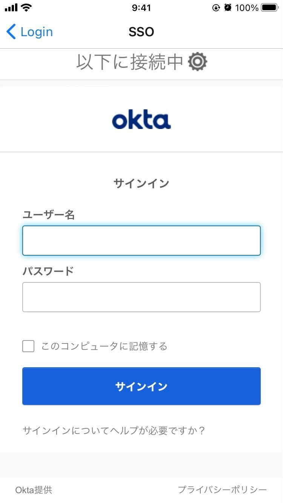
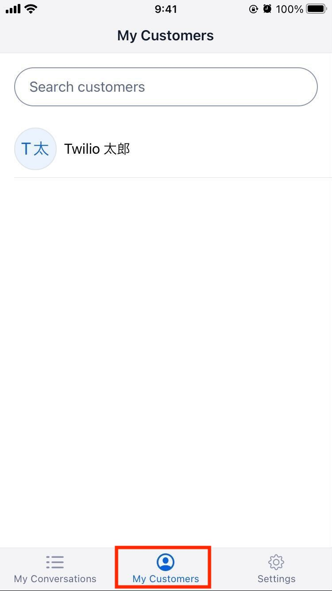
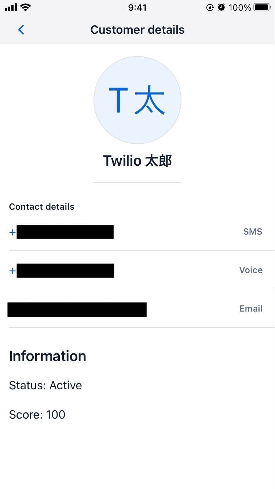

# Integration Serviceの設定

::: danger 警告

Twilio Frontlineを利用する場合、アカウントが[Organization](https://www.twilio.com/docs/iam/organizations)に属している必要があります。この機能は組織内において複数のユーザーやアカウントを管理できる機能となります。ただし、現時点で一度作成したOrganizationは __コンソールから削除できません。__ 削除する場合はサポートへの問い合わせが必要となるため、Organizationの使用有無や使用可能が判断できない場合は、ハンズオンを実施せずにデモをご確認ください。

また、Twilio FrontlineはTwilio Flexで利用されているプロジェクトでは利用できません。 さらに、内部ではTwilio ConversationsやTwiML Appsなどを活用しています。そのため、既存のTwilioアカウントでTwilio Frontlineを設定した場合、もともとの設定が変更されてしまう可能性があります。できるだけ新しいアカウント、あるいはサブアカウントでハンズオンを実施してください。

Twilio Frontlineはテキストチャットが初期の機能として実装され、その後音声通話に対応しました。そのため、接続するTwilio番号はSMS、音声両方の機能に対応している必要があります。2022年2月現在、コンソールから購入可能な日本の番号はSMSに対応していないため、米国番号でハンズオンを実施してください。

::::

Twilio Frontlineを利用する場合、シングルサインオン（SSO）の設定や、CRMと連携するバックエンドアプリケーションを構築する必要があります。今回のハンズオンは[Twilio Frontline Node.js Quickstart](https://www.twilio.com/docs/frontline/nodejs-demo-quickstart)に沿って設定します。


__目次__
[[toc]]

## 顧客リストの取得

Frontline Integration ServiceはCRMやデータベースに存在する連絡先情報を取得し、Frontlineで使用できるように加工する機能を担っています。サンプルでは実際にデータベースに接続するのではなく、サンプル連絡先を定義します。`/src/providers/customers.js`を開き、36行目の`customers`配列を次のように設定します。顧客の名前やemail、smsを受け取る番号については適宜変更してください。
また、Frontlineでは1人の顧客に対して1ユーザーを事前に割り当てます。`workder`には先ほどOktaでアプリケーションに追加したユーザーのメールアドレスを追加します。

```js
const customers = [
      {
         customer_id: 98,
         display_name: 'Twilio 太郎',
         channels: [
             { type: 'email', value: 'twilio-taro@example.com' },
             { type: 'sms', value: '+123456789' },
         ],
         details:{
             title: "Information",
             content: "Status: Active" + "\n\n" + "Score: 100"
         },
         worker: '先ほどOktaで指定したユーザーのメールアドレス'
      }];
```

## サンプルの再起動とトンネリング

サンプルアプリケーションを再起動し、さらにパブリックインターネットからアクセスできるように`ngrok`などのツールを使い、トンネリングを行います。

```bash
ngrok http 3000
```

無料版のngrokを使用した場合、ランダムな値（例: `https://123456.ngrok.io`）がURLとして生成されます。この生成されたURLを控えておきます。

Frontlineコンソールに戻り、`Callbacks`画面を開きます。下記の2つのフィールドに値を設定します。

|名前| 値 |
|---|---|
| CRM Callback URL| ngrokのURL`/callbacks/crm` |
| CRM Callback URL| ngrokのURL`/callbacks/outgoing-conversation` |



これでテキストメッセージが使えるようになりました。

## 音声通話を有効化

初期状態では音声通話が無効化されているため、`Voice Calling`画面を開き、有効化します。この際、Frontlineで使用するTwilio番号の設定において着信時にFrontline用のTwiML Appが処理を行うように定義する必要があります。



今回はSMSの受信、発信に利用しているTwilio番号に設定します。電話番号の設定画面において`CONFIGURE WITH`に`TwiML App`と指定し、`TWIML APP`には自動的に構築された`Voice in Frontline`を指定します。下記のスクリーンショットを参考にしてください。



## Twilio Frontlineをインストールし、テストを実施

全ての設定が完了しました。[App Store](https://apps.apple.com/app/id1541714273)または[Google PLay Store](https://play.google.com/store/apps/details?id=com.twilio.frontline)からTwilio Frontlineをインストールし、起動します。

起動時に`workspace ID`を求められます。先ほど設定した値を入力します。



次に設定したアイデンティティプロバイダーのサインイン画面が表示されます。



サインインが完了すると会話の一覧画面が表示されます。`My Customers`タブを開いて先ほど定義したテスト顧客が表示されていることを確認してください。



テスト顧客をタップすると詳細情報が表示されます。VoiceまたはSMSをタップし、実際にメッセージが送信されること、あるいは通話ができることを確認します。




