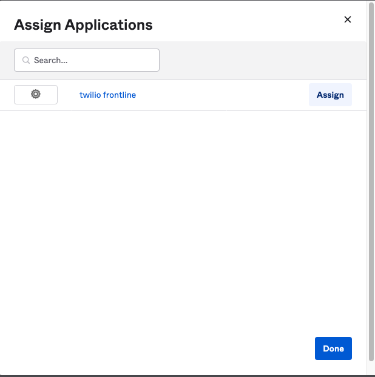

# Oktaを使用したSSOの設定

::: danger 警告

Twilio Frontlineを利用する場合、アカウントが[Organization](https://www.twilio.com/docs/iam/organizations)に属している必要があります。この機能は組織内において複数のユーザーやアカウントを管理できる機能となります。ただし、現時点で一度作成したOrganizationは __コンソールから削除できません。__ 削除する場合はサポートへの問い合わせが必要となるため、Organizationの使用有無や使用可能が判断できない場合は、ハンズオンを実施せずにデモをご確認ください。

また、Twilio FrontlineはTwilio Flexで利用されているプロジェクトでは利用できません。 さらに、内部ではTwilio ConversationsやTwiML Appsなどを活用しています。そのため、既存のTwilioアカウントでTwilio Frontlineを設定した場合、もともとの設定が変更されてしまう可能性があります。できるだけ新しいアカウント、あるいはサブアカウントでハンズオンを実施してください。

Twilio Frontlineはテキストチャットが初期の機能として実装され、その後音声通話に対応しました。そのため、接続するTwilio番号はSMS、音声両方の機能に対応している必要があります。2022年2月現在、コンソールから購入可能な日本の番号はSMSに対応していないため、米国番号でハンズオンを実施してください。

::::

__目次__
[[toc]]

## SSOについて

Twilio Frontlineを使用する場合は、アイデンティティプロバイダーを導入しておりシングルサインオン（SSO）が設定されている必要があります。ここでは[Oktaを利用する方法](https://www.twilio.com/docs/frontline/sso/okta)を日本語で解説します。その他のプロバイダーに関しては下記をご覧ください。

- [Salesforce](https://www.twilio.com/docs/frontline/sso/salesforce)
- [Google](https://www.twilio.com/docs/frontline/sso/google)
- [Microsoft Azure AD](https://www.twilio.com/docs/frontline/sso/azure-ad)

## Oktaアプリケーションの作成

Oktaデベロッパーアカウントを保有していない場合は[こちら](https://developer.okta.com/)から作成します。作成後、ポータルにサインインします。

新しいアプリケーションを作成するため、ナビゲーションから、`Applications`を選択し、`Create App Integration`ボタンをクリックします。

Sign-in methodを選択する画面では`SAML 2.0`を選択し、`Next`ボタンをクリックします。

続いてアプリケーションの名前を設定し、`Next`ボタンをクリックします。

SAML Sesstings画面では、`Singe sign on URL`並びに`Audience URI (SP Entity ID)`を指定する必要があります。

ここで使用する情報を取得するため、別タブでTwilioコンソールのFrontlineを開き、`SSO/Log in`画面を表示します。この画面に表示される`Realm SID`を控えます。

Oktaの設定画面に戻り、`Singe sign on URL`並びに`Audience URI (SP Entity ID)`をそれぞれ次のように設定します。

|名前|値|
|---|---|
| Singe sign on URL| https://iam.twilio.com/v2/saml2/authenticate/Realm SIDの値|
| Audience URI (SP Entity ID)| https://iam.twilio.com/v2/saml2/metadata/Realm SIDの値|

## 属性を定義

続いて下方向にスクロールし、`Attribute Statements (optional)`に下記の値を追加します。

|Name| Name format| Value |
|---|---|---|
| email| Basic | user.email|
| roles| Basic| user.userType|

`Next`ボタンをクリックし次に進みます。

最後の画面はサポートを受けるための質問です。`I'm an Okta customer adding an internal app`を選択し、追加フィールドに入力が可能な情報については入力します。特に必須ではありません。

`Finish`ボタンをクリックし、終了します。

## Setup Instructionsをコピー

アプリケーションの設定画面へと遷移した状態で、画面に表示されているSAML 2.0のSetup Instructionsを表示します。

表示される画面で確認できる次の値を全て控えておきます。

- Identity Provider Single Sign-On URL:
- Identity Provider Issuer:
- X.509 Certificate:

## ユーザーの設定 - User typeを定義

ナビゲーションから`Directory` - `People`を選択し、Twilio Frontlineの使用ユーザーとなるユーザーの詳細情報を開きます。

`Profile`タブをクリックし、プロファイルを修正します。

`User type`に`agent`と入力し、`Save`ボタンをクリックします。

## ユーザーの設定 - アプリケーションに割り当て

`Applications`タブを開き、`Assign Applications`ボタンをクリックします。

一覧から先ほど作成したアプリケーションを割り当てます。

割り当てが完了すると`Assigned Applications`の一覧に表示されます。

## FrontlineのSSO設定を完了

先ほどRealm SIDを確認したFrontlineの`SSO/Log in`設定画面に戻り、次の項目を入力します。

|名前| 値 |
|---|---|
| Workspace ID| 2文字以上21文字以内の英数字 |
| Identity provider issuer| Oktaから取得した値|
| SSO URL| Oktaから取得した値|
| X.509 Certificate| Oktaから取得した値|

下記のスクリーンショットも参考にしてください。

これでSSOの設定が完了しました。
