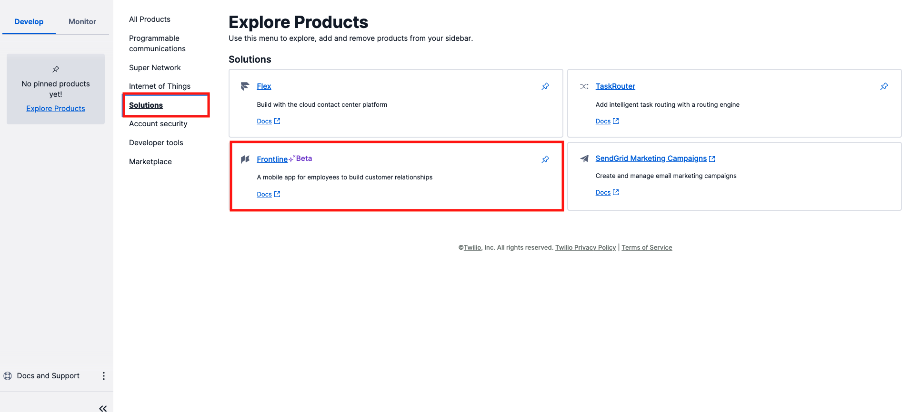
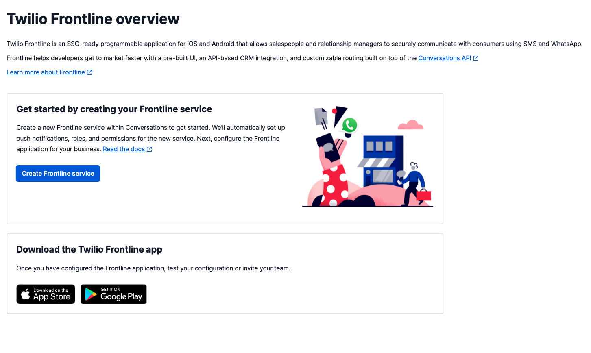
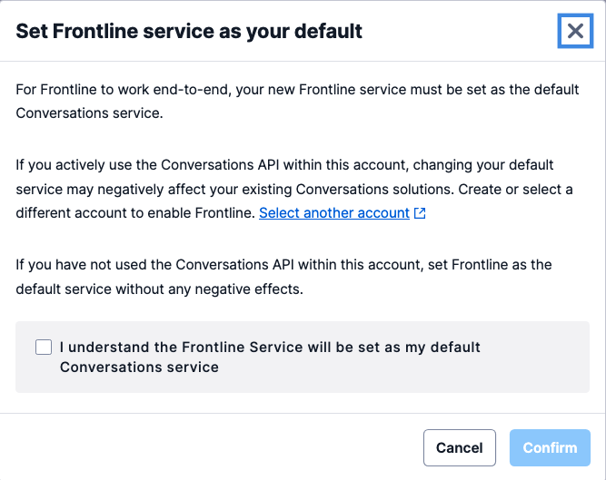
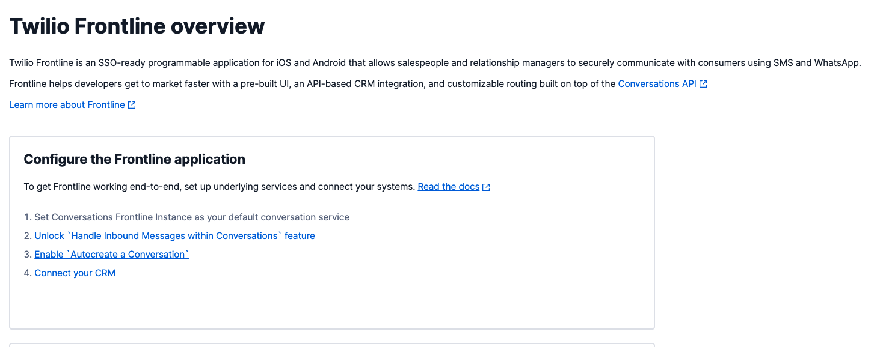
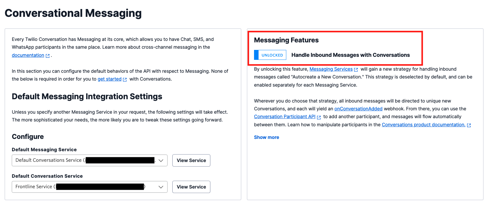
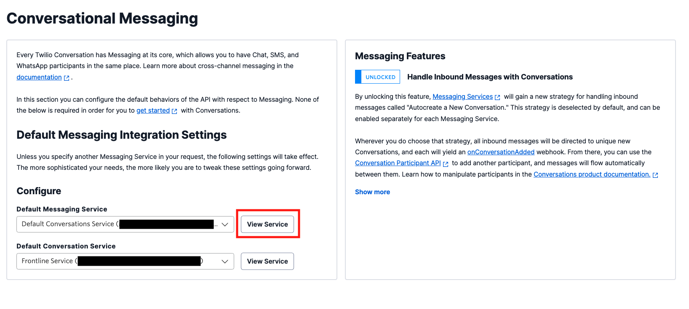
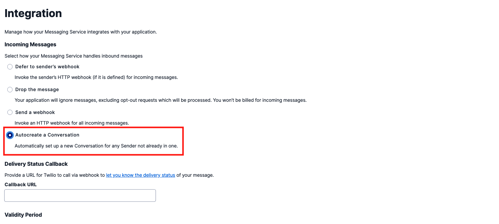
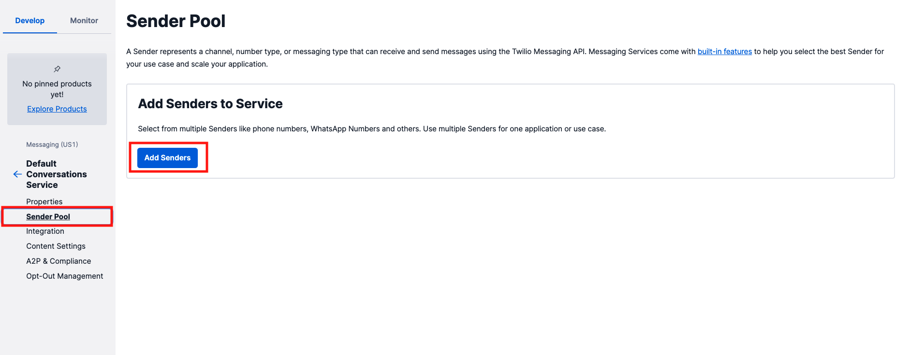
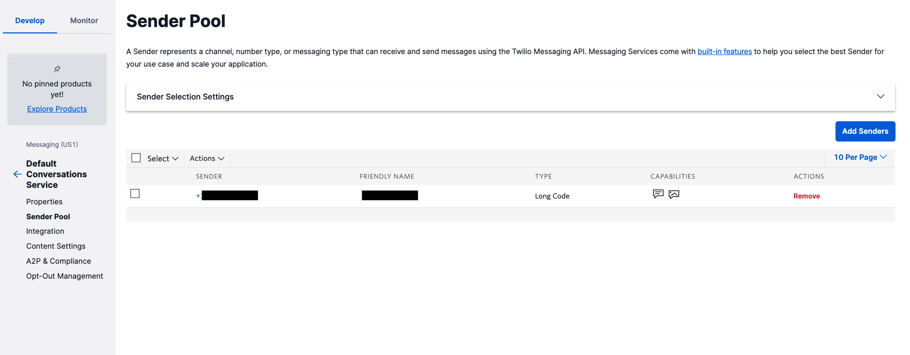

# Twilio Frontlineの利用

::: danger 警告

Twilio Frontlineを利用する場合、アカウントが[Organization](https://www.twilio.com/docs/iam/organizations)に属している必要があります。この機能は組織内において複数のユーザーやアカウントを管理できる機能となります。ただし、現時点で一度作成したOrganizationは __コンソールから削除できません。__ 削除する場合はサポートへの問い合わせが必要となるため、Organizationの使用有無や使用可能が判断できない場合は、ハンズオンを実施せずにデモをご確認ください。

また、Twilio FrontlineはTwilio Flexで利用されているプロジェクトでは利用できません。 さらに、内部ではTwilio ConversationsやTwiML Appsなどを活用しています。そのため、既存のTwilioアカウントでTwilio Frontlineを設定した場合、もともとの設定が変更されてしまう可能性があります。できるだけ新しいアカウント、あるいはサブアカウントでハンズオンを実施してください。

Twilio Frontlineはテキストチャットが初期の機能として実装され、その後音声通話に対応しました。そのため、接続するTwilio番号はSMS、音声両方の機能に対応している必要があります。2022年2月現在、コンソールから購入可能な日本の番号はSMSに対応していないため、米国番号でハンズオンを実施してください。

::::

Twilio Frontlineを利用する場合、シングルサインオン（SSO）の設定や、CRMと連携するバックエンドアプリケーションを構築する必要があります。今回のハンズオンは[Twilio Frontline Node.js Quickstart](https://www.twilio.com/docs/frontline/nodejs-demo-quickstart)に沿って設定します。


__目次__
[[toc]]

## Twilio Frontlineを利用するための前提条件

Twilio Frontlineを利用するためにはいくつかの条件を満たす必要があります。

- 使用するTwilioアカウントが[Organization](https://www.twilio.com/docs/iam/organizations)に属していること
- Oktaなどのアイデンティティプロバイダーを導入しておりシングルサインオン（SSO）が設定されていること
- iOS、またはAndroid端末を保有していること　


## Frontlineサービスの作成

Twilioコンソールの`Explore Products`から`Solutions` - `Frontline`を選択します。



Overview画面で`Create Frontline service`ボタンをクリックします。



サービスを作成する前にTwilio Conversationsサービスについての警告が表示されます。Twilio Frontlineが作成するConversationサービスをアカウントのデフォルトとする旨について同意を求められます。既に別のアプリケーションで利用している場合は、アカウントを切り替えてください。問題なければ`Confirm`ボタンをクリックします。



Frontline用のConversationsサービスが作成され、Frontlineのoverviewページへと遷移します。
この画面に表示されている２-4のステップを実施します。



## Twilio Conversationsの設定

Frontline用に作成したConversationサービスの設定を次に行います。`Unlock Handle Inbound Messages within Conversations feature` リンクをクリックし、画面右の`Handle Inbound Messages with Conversations`を`UNLOCKED`状態に設定します。この設定で双方向のテキストチャットが有効になります。



`Save`ボタンをクリックし変更を反映させます。


## メッセージングサービスの設定

続けて`Default Messaging Service`に設定されているの詳細画面を開くため、`View Service`ボタンをクリックします。



メッセージングサービスの`Integration`画面が表示された状態で、`Incoming Messages`の設定値を`Autocreate Conversation`と変更します。

これでFrontlineが使用するTwilio番号でメッセージを受信した場合に正しく処理されます。



こちらも`Save`ボタンをクリックし、変更を反映させます。

続けてこのメッセージングサービスで使用する電話番号を割り当てるため、左側のナビゲーションから`Sender Pool`ボタンをクリックします。



`Add Senders`ボタンをクリックし、Frontlineで使用するTwilio番号をこのサービスに紐付けます。



これでTwilio番号とメッセージングサービス、Twilio ConversationsがFrontline用に設定されました。

## Twilio Frontline Integration Serviceの設定

Twilio Frontlineを使用するためにはアプリケーションと連絡先情報を持つCRM、あるいはデータベースと連携する必要があります。クイックスタートでは[Node.jsで実装されたサンプル](https://github.com/twilio/frontline-demo-service)が用意されているため、ローカルにコピーします。ターミナルを開き、次のコマンドを実行します。

```bash
git clone https://github.com/twilio/frontline-demo-service.git
```

ターミナルでローカル環境にコピーしたサンプルのフォルダに移動し、依存関係をインストールします。

```bash
yarn
```

続いて環境変数を設定する必要があるため、`.env.example`ファイルをコピーし、`.env`ファイルと名前を変更します。

あらかじめ定義されている変数のうち`TWILIO_WHATSAPP_NUMBER`以外の値を設定します。`ACCOUNT_SID`ならびに`AUTH_TOKEN`はコンソールのトップページから、また、先ほどSender Poolに追加したTwilio番号を`TWILIO_SMS_NUMBER`に設定します。さらに`PORT`という名前をもつ環境変数を追加し、値を`3000`と定義します。下記の内容を参考にしてください。

```
TWILIO_ACCOUNT_SID=ACxxxxxxxxxxxxxxxxxxxxxxxxxxxxxxxx
TWILIO_AUTH_TOKEN=xxxxxxxxxxxxxxxxxxxxxxxxxxxxxxxx
TWILIO_SMS_NUMBER=+xxxxxxxxxxx
PORT=3000
```

環境変数が設定できた段階で、アプリケーションを起動します。

```bash
yarn run start
```


